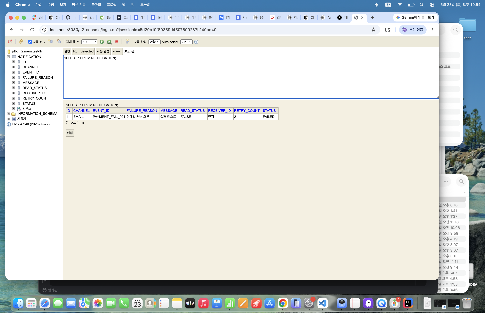

# Notification System

## 프로젝트 개요

이 프로젝트는 이벤트 기반 알림 발송 시스템입니다.

사용자가 결제, 수강 신청 등의 이벤트를 발생시키면
알림 요청을 저장하고 비동기 처리기를 통해 알림을 발송합니다.

실패 시 재시도 정책을 적용하며,
중복 발송 방지, 읽음 처리, 실패 이력 보관 기능을 제공합니다.

또한 실제 운영 환경을 고려하여
메시지 큐, 재시도 정책, DB 확장 가능성까지 함께 고민했습니다.

---

## 기술 스택

- Java 17
- Spring Boot
- Spring Data JPA
- H2 Database
- Gradle

---

## 실행 방법

프로젝트 실행:

```bash
./gradlew bootRun
```

테스트 실행:

```bash
./gradlew test
```

---

## API 목록

### 알림 생성

POST `/notifications`

예시:

```json
{
  "receiverId":"민경",
  "message":"결제 완료",
  "eventId":"PAYMENT_001",
  "channel":"EMAIL"
}
```

---

### 전체 조회

GET

```http
GET /notifications
```

---

### 단건 조회

GET

```http
GET /notifications/{id}
```

---

### 사용자별 조회

GET

```http
GET /users/{receiverId}/notifications
```

예:

```text
/users/민경/notifications
```

---

### 읽음 처리

PATCH

```http
PATCH /notifications/{id}/read
```

---

## 요구사항 해석 및 가정

### 비동기 처리

실제 메시지 브로커(Kafka, RabbitMQ)는 사용하지 않고

`@Scheduled`

기반 처리기로 구현했습니다.

처리 흐름:

```text
알림 요청
↓
REQUESTED 저장
↓
사용자 응답 반환
↓
백그라운드 처리
↓
SENT / FAILED
```

즉 사용자 요청과 실제 발송 로직을 분리하여
비동기 흐름을 구성했습니다.

운영 환경에서는 Queue(Kafka, RabbitMQ) 전환 가능성을 고려했습니다.

---

### 재시도 정책

실패 시 최대 3회 재시도.

현재 구현:

```text
5초 간격
최대 3회
```

흐름:

```text
REQUESTED
↓
PROCESSING
↓
FAILED
↓
retryCount 증가
↓
최대 3회
↓
최종 실패
```

최종 실패 시:

- FAILED 상태 유지
- failureReason 저장
- 추후 관리자 재처리 가능성 고려

---

### 재시도 개선 가능성

현재:

```text
5초 → 5초 → 5초
```

운영 환경 개선 방향:

지수 백오프(Exponential Backoff)

예:

```text
1차 실패 → 5초
2차 실패 → 30초
3차 실패 → 5분
```

서버 부하 감소 및 일시 장애 대응 가능.

---

### 중복 발송 방지 (멱등성)

중복 기준:

```text
receiverId + eventId
```

적용 방식:

- Service 중복 체크
- DB Unique 제약

중복 요청 발생 시:

```text
중복 알림 요청 - 저장하지 않음
```

처리.

---

## 설계 결정과 이유

### 왜 H2 사용?

빠른 개발 및 테스트 목적.

운영 환경에서는 PostgreSQL / Aurora 전환 가능하도록
JPA 기반으로 설계했습니다.

---

### 왜 JPA 사용?

객체 중심 설계 가능.

알림 상태:

```text
REQUESTED
PROCESSING
FAILED
SENT
```

와 같은 상태 관리 구현이 용이합니다.

---

### 왜 @Scheduled 사용?

과제 조건:

> 실제 메시지 브로커 설치 불필요

조건을 만족하면서 비동기 구조를 구현할 수 있다고 판단했습니다.

---

## DB 설계

### Notification

| 컬럼 | 설명 |
|------|------|
| id | PK |
| receiverId | 수신자 |
| message | 알림 내용 |
| eventId | 이벤트 ID |
| status | 상태 |
| retryCount | 재시도 횟수 |
| failureReason | 실패 이유 |
| readStatus | 읽음 여부 |
| channel | 발송 채널 |

상태 흐름:

```text
REQUESTED
↓
PROCESSING
↓
SENT

또는

FAILED
```

---

## H2 Database 확인

H2 Console 접속:

```text
http://localhost:8080/h2-console
```

예시 SQL:

```sql
SELECT * FROM NOTIFICATION;
```

실제 저장 데이터 확인:



해당 화면을 통해:

- retryCount 확인
- FAILED 상태 확인
- failureReason 저장 확인
- DB 저장 여부 확인

---

## 구현 완료 기능

완료:

- [x] 알림 생성 API
- [x] 전체 조회
- [x] 단건 조회
- [x] 사용자별 조회
- [x] 읽음 처리
- [x] 상태 관리
- [x] 실패 처리
- [x] 재시도
- [x] 최종 실패 처리
- [x] 실패 이력 저장
- [x] 중복 발송 방지
- [x] 비동기 처리
- [x] DB 저장
- [x] H2 Console 조회
- [x] 테스트 코드 작성

---

## 테스트 코드

작성 테스트:

- 알림 저장 테스트
- 중복 방지 테스트
- 읽음 처리 테스트
- 실패 처리 테스트
- 상태 변경 테스트

실행:

```bash
./gradlew test
```

테스트 결과:

```text
BUILD SUCCESSFUL
5개 테스트 통과
```

---

## 선택 구현 반영 사항

### 읽음 처리

단일 상태 변경 방식으로 구현.

다중 기기 환경에서는 낙관적 락(Optimistic Lock) 또는 버전 관리 기반 충돌 방지가 필요할 수 있습니다.

구현 API:

```http
PATCH /notifications/{id}/read
```

---

### 최종 실패 보관

최대 재시도 이후:

```text
FAILED 유지
failureReason 저장
```

운영 환경에서는 관리자 수동 재시도 API 추가 가능.

재시도 정책에 따라 retryCount 초기화 여부를 정책화할 수 있습니다.

---

## 개선 가능 사항

미구현:

- [ ] 예약 발송 (scheduledAt)
- [ ] 메시지 템플릿 관리
- [ ] Queue(Kafka/RabbitMQ)
- [ ] 지수 백오프
- [ ] 다중 인스턴스 환경
- [ ] 관리자 재발송 기능
- [ ] 동시 읽음 처리 충돌 방지

---

## AI 활용 범위

ChatGPT 활용:

- 구조 설계
- 상태 관리
- 예외 처리
- README 초안
- 비동기 처리 아이디어
- 재시도 정책 개선 방향
- 테스트 코드 아이디어

최종 구현, 테스트 코드 작성 및 검증은 직접 수행했습니다.