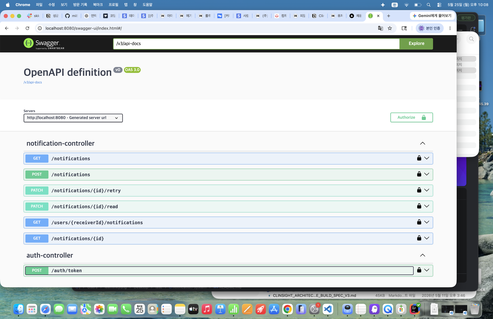
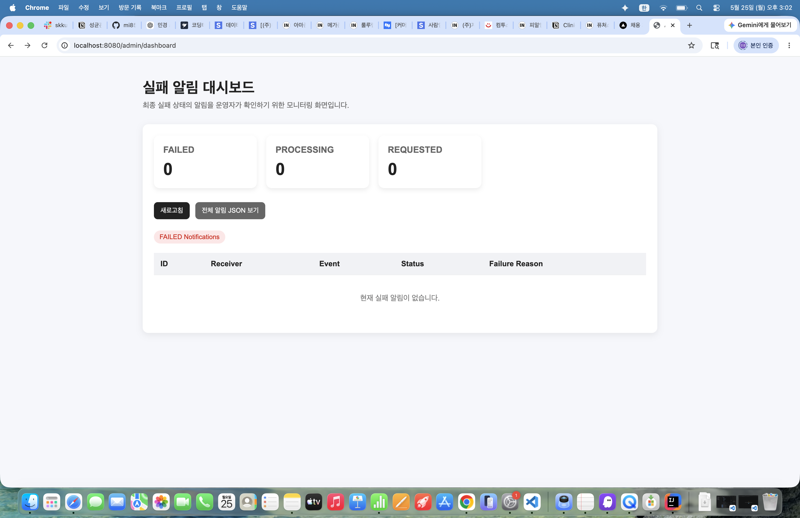

# Notification System

프로덕트 엔지니어 채용 과제 **BE-C. 알림 발송 시스템** 구현 프로젝트입니다.

이 프로젝트는 수강 신청 완료, 결제 확정, 강의 시작 D-1, 취소 처리 등 다양한 이벤트가 발생했을 때 사용자에게 이메일 또는 인앱 알림을 발송하는 상황을 가정합니다.

알림 요청 API는 실제 발송을 즉시 수행하지 않고 DB에 저장하며, 별도 Processor가 저장된 요청을 조회하여 비동기적으로 처리합니다.

---

# 프로젝트 개요

구현 목표:

- 알림 발송 요청 등록
- 알림 상태 조회
- 사용자별 알림 목록 조회
- 읽음 처리
- 실패 시 재시도
- 실패 사유 기록
- 중복 발송 방지
- 서버 재시작 후 재처리
- 관리자 대시보드
- JWT 기반 관리자 인증

---

# 기술 스택

Backend

- Java 17
- Spring Boot
- Spring Security
- Spring Data JPA
- JWT
- PostgreSQL
- H2
- Thymeleaf
- Swagger
- JUnit5

---

# 실행 방법

## DB 생성

```sql
CREATE DATABASE notification_db;
```

application.properties 설정:

```properties
spring.datasource.url=jdbc:postgresql://localhost:5432/notification_db
spring.datasource.username=계정
spring.datasource.password=비밀번호
```

실행:

```bash
./gradlew bootRun
```

Swagger:

```text
http://localhost:8080/swagger-ui/index.html
```

---

# 화면 예시

## Swagger API 문서

JWT 토큰 발급, 알림 등록, 상태 조회 등의 API를 Swagger를 통해 확인할 수 있습니다.



지원 API:

- POST /notifications
- GET /notifications
- PATCH /retry
- PATCH /read
- POST /auth/token

---

## 관리자 대시보드

실패 알림 모니터링과 상태 확인을 위한 관리자 화면입니다.



제공 기능:

- FAILED 알림 조회
- PROCESSING 상태 모니터링
- REQUESTED 상태 확인
- 전체 알림 JSON 조회
- 수동 재시도

---

# 요구사항 해석 및 가정

다음 기준으로 요구사항을 해석했습니다.

- 알림 요청 API는 요청 접수만 수행
- 실제 발송은 비동기 처리
- 실패 시 재시도 가능해야 함
- 서버 재시작 후 복구 가능해야 함
- 동일 이벤트 중복 저장 방지
- 실제 브로커 없이 향후 Kafka/RabbitMQ 확장 가능해야 함

---

# 설계 결정과 이유

## DB Polling 기반 비동기 처리

실제 메시지 브로커 없이 구현해야 하는 과제 조건 때문에 DB Polling 구조를 선택했습니다.

장점:

- API 응답 빠름
- 장애 복구 가능
- 추후 메시지 브로커 확장 가능

---

## 상태 기반 처리

알림 상태:

```text
REQUESTED
PROCESSING
SENT
FAILED
```

상태 흐름:

```text
REQUESTED
 ↓
PROCESSING
 ↓ 성공
SENT

PROCESSING
 ↓ 실패
FAILED
 ↓ 재시도
PROCESSING
```

---

## 실패 정보 저장

실패 시 저장:

```text
retryCount
failureReason
nextRetryAt
```

---

## 중복 방지

현재 기준:

```text
receiverId + eventId
```

동일 이벤트는 저장하지 않습니다.

---

## JWT 인증

JWT 기반 관리자 인증 구현:

토큰 발급:

```http
POST /auth/token
```

요청:

```json
{
 "username":"admin",
 "password":"admin1234"
}
```

JWT 내부:

```text
ROLE_ADMIN
```

JWT 필터에서 권한을 복원하여:

```text
/admin/**
```

접근 제어 수행

---

# 비동기 처리 구조

```text
Client
 ↓

Notification API
 ↓

DB 저장
REQUESTED
 ↓

Processor
 ↓

PROCESSING
 ↓

Mock Sender
 ↓

SENT / FAILED
```

---

# 재시도 정책

실패 시:

```text
retryCount 증가
failureReason 저장
nextRetryAt 저장
```

최대 재시도 초과 시 실패 상태 유지

운영자는 수동 재시도 가능

---

# 운영 시나리오 대응

### 서버 재시작

DB 저장 기반:

```text
REQUESTED
FAILED
PROCESSING
```

재조회 후 복구 가능

---

### 장애 복구

PROCESSING 상태 장시간 유지 시 재처리

---

### 실패 이력 보존

저장:

```text
failureReason
retryCount
```

---

### 수동 재시도

관리자가 REQUESTED 상태로 변경 가능

---

# API 목록 및 예시

## 알림 요청

```http
POST /notifications
```

요청:

```json
{
 "receiverId":"user1",
 "eventId":"PAYMENT_SUCCESS",
 "channel":"EMAIL"
}
```

---

## 상태 조회

```http
GET /notifications/{id}
```

---

## 읽음 처리

```http
PATCH /notifications/{id}/read
```

---

## 재시도

```http
PATCH /notifications/{id}/retry
```

---

# 데이터 모델

Notification 주요 필드

| 필드 | 설명 |
|-----|-----|
| id | 알림 ID |
| receiverId | 수신자 |
| eventId | 이벤트 |
| status | 상태 |
| retryCount | 재시도 |
| failureReason | 실패 사유 |
| nextRetryAt | 재시도 예정 |
| readStatus | 읽음 여부 |
| version | 낙관적 락 |

---

# 테스트 실행

```bash
./gradlew test
```

검증:

- REQUESTED 저장
- 중복 방지
- 상태 변경
- 재시도
- 읽음 처리

---

# 미구현 / 제약사항

현재 미구현:

- 실제 이메일 서버
- Kafka
- RabbitMQ
- Redis Lock
- Refresh Token
- 다중 인스턴스 완전 경쟁 제어

향후:

```text
SELECT FOR UPDATE
SKIP LOCKED
Consumer Group
```

확장 가능

---

# AI 활용 범위

AI 활용:

- 요구사항 해석
- JWT 구조 점검
- 상태 전이 검토
- README 구성
- 테스트 보강 방향 검토

최종 구현과 검증은 직접 수행했습니다.